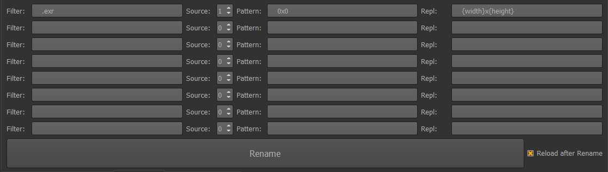
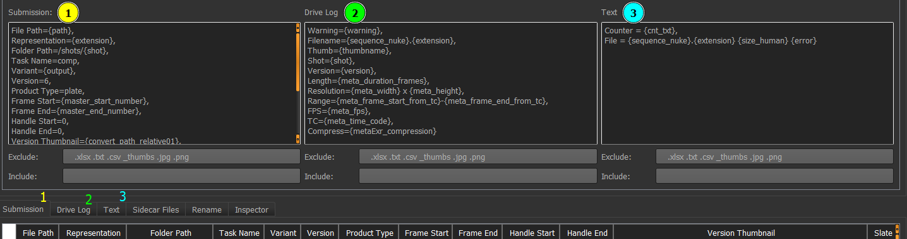

# Submission Helper

This tool is helping vfx studios to share and ingest data.

Each sending usually consists of one or more files, together with a spreadsheet that binds the media files with additional info like notes, status, version, task…

This process doesn't seem to have an industry standard; Submission Helper has many options to help interface vendors and production with as little friction as possible.

# Intended use

The Package starts with one or more files that you want to package and send. Submission Helper can check the files and helps to produce spreadsheet(s) and email summary that is easily ingested in the receiver's system, often automatically.

# Features

* Helps to name the package by the template, including consecutive or per day versions  
* Reads metadata from the files by ffprobe, oiiotool and other methods.  
* Calculates file sizes.  
* Allows gathering and copying sidecar files like CDLs or LUTs to the package.  
* Allows defining spreadsheet columns and values in a flexible way.  
* Generates up to two spreadsheets that are called submission and drive log.  
* Generates a text file often used for email that follows up the package sending.  
* Can read notes and other data from the ftrack.  
* Can read info from Ayon database.  
* Allows for checking for holes in file sequences, files with zero size and other common problems  
* Allows saving the ui as a json settings file for reuse or sharing with vendors  
* Can be used head-less.

# Quick Start

Submission Helper assumes you put the file(s) in one folder \- the Package Folder.

* Drag the package folder path anywhere to the Submission Helper window  
* Set the Package Name options, till the preview matches what you need  
* Use Spreadsheet tab to define columns and their values  
* Set the export options in Exports and text tabs  
* Set conditions in Check tab to highlight the files that do not adhere to intended specs  
* Press Go to export the spreadsheet

# Package Name

Assists with adhering to naming convention. Typically, coordinator gathers all the files to be sent in one folder with temp name, for example: {show}/out/submissions/temp\_name

SH checks the parent directory of the package ({show}/out/submissions) and detects previous sendings. If the Name from Template (4) is active, SH will rename the temp\_name according to template, with the next version available. Preview shows the package name to be used for rename.

Using regular expressions allows for very flexible naming options. Some productions want to simply number the sendings from one up, but include the date in the name (the example shown). It is important to understand that Date Regex (2) and Version Regex (3) are used for detecting already used versions in the parent directory of the package, and Template is used to construct new names. The {package\_version} token in the template is replaced by the next available version.

Editorial sometime prefers to send packages that are versioned per date:

* 20251224\_0001  
* 20251224\_0002  
* 20251225\_0001

Or per date with letter:

* 20251224\_A  
* 20251224\_B  
* 20251225\_A

# Parsing Tab

Parsing Tab allows you to define custom, per file tokens. Those tokens can be derived from file name or path, or from file metadata.

An easy way to learn what metadata is available is to use Inspector Tab.

For every file (or file sequence) SH detects, it first scans for metadata, and then processes the Parsing Tab from top to bottom. Note that you can use the tokens defined in upper lines in lower lines, defining other tokens. For tokens with the same name, lower lines overwrite upper lines.

There are five columns in the parsing tab:

1. Name: The name of newly created token  
2. Pattern: Regular expression to define the pattern  
3. Repl: Replace expression. If empty, first matching group is used as an output  
4. Source: The source string for the Pattern search (can use tokens)  
5. Filter: Only process the line if part of the file name contains string in Filter

## Example: Parsing Shot Name

Let’s say your naming convention adheres to {seq}\_{shot}\_{task}\_v{version}  
Your package contains files like  
{package\_root}/001\_0010\_comp\_v001.mov  
{package\_root}/001\_0010\_comp\_v001/001\_0010\_comp\_v001.1001.exr

First line uses file name (001\_0010\_comp\_v001.mov, 001\_0010\_comp\_v001.1001.exr) with pattern ^(\[^\_\]\*)\_(\[^\_\]\*)\_(\[^\_\]\*).\*$ and Repl string outputs first two groups \- pattern parentheses separated by underscore: \\1\_\\2. This defines the short name for both files as 001\_0010.

The second line uses {part2} token as a source, which is “one folder up from the detected file name. File sequences typically have a per sequence folder. This line forces SH to use the name not from the file name, but from its parent folder, with a filter to only do this for EXR files.  
{package\_root}/001\_0010\_comp\_v001/001\_0010\_comp\_v001.1001.exr  
This shows how to overwrite the shot token for specific file formats.

The third line is very similar to the first line, but only outputs the part of the file name before the first underscore as a sequence name.

The fort line shows that Repl string can be also a Python code starting with lambda pattern:  
This might be necessary for string manipulations not possible with bare regular expressions, like uppercase / lowercase, or calculations.

# Convert Tab

Convert Tab allows you to run one or more external processes per file.

The Convert on Go checkbox forces SH to do the processing when the Go button is pressed.

The Skip Existing checkbox evaluates the expected output file name for each convert first, and only executes the process if the file doesn’t exist. One package can often include a bunch of outputs from the same shot/asset version \- exr sequence, mp4 preview, DNxHD mov for editorial… This option allows you to skip unnecessary processing. For example, if you define first convert to use mov file for converting to thumbnail with the name of the shot and version, and second line to do the same from EXR files, the thumbnail from EXRs processing will be skipped if the thumbnail from mov output already exists.

There are four columns in the convert tab line:

1. If: Python expression, only run the process if true  
2. Executable: The executable used, some tokens are defined by SH installation.  
3. Arguments: The command line  
4. File Name: Expected output. Used for Skip Existing checkbox.

## Example: Creating Thumbnails from EXR files

The if condition '{extension}' in \['exr'\] makes sure only exr files are processed.  
The {oiio} executable is defined by SH installation, you can use the full path here if preferred.

Command line arguments:

\-i {path\_prs}/{clean\_name}{meta\_thumbnail\_frame}.{extension}  
The {meta\_thumbnail\_frame} token is prepared during file scan, it is the middle frame of file sequence. For ffmpeg, there is a {meta\_thumbnail\_time} token for the middle of the container file.

\--colorconfig {ocio}  
The {ocio} token is determined by SH installation or preferences.

\--colorconvert "{colorspace}" "Output \- Rec.709"  
The {colorspace} token is set by Parsing Tab, for example “ACES \- ACES2065-1” for EXRs.

\--resize 1280x0  
Resize to the width of 1280 pixels, keep aspect ratio

\-o {package\_name\_root}/{package\_name}/\_thumbs/{thumbname}.jpg  
The {thumbname} token is set by Parsing Tab

File name is a copy out output argument above:  
{package\_name\_root}/{package\_name}/\_thumbs/{thumbname}.jpg

# Sidecar Tab

Can be used to copy additional files from your project to the package. For example, some productions deliver per shot CDL files to vfx vendors, and require to forward the CDLs to the finishing vendor together with finals.

The Search Folder (1) is the path where to search for files. Exclude field allows skip file names with particular strings. Include will only accept files with particular strings in the file name.

The Submission Only / Log Only / All options will only consider package files listed in Submission or Drive log tabs.

There are five columns in the sidecar tab line:

1. Pattern: Regex pattern to be applied to the found file  
2. Repl:  Repl pattern to be applied to the found file  
3. If match to: If Repl matches to this field  
4. Dest: Path to where to copy (and maybe rename) the sidecar file.  
5. Filter: Only consider found files that have this string in file name

## The process

Find all sidecar files that match the Search folder, Exclude and Include conditions.  
Get list of files detected by SH (use Submission only/Log Only/All to limit the list).  
For every file in the detected list, for every sidecar file, for every sidecar line, find the destination. For all matching sidecar files, list the source and destination in the bottom Sidecar Tab (2).

# Rename Tab

Can be used for renaming the files by client requirements. For example, some productions require a resolution folder in the form {width}x{height} in the path of delivered file sequences.

Your temp\_folder has {package}/{shot}\_{task}\_v{version}/0x0/{shot}\_{task}\_v{version}.1001.exr

The Rename tab allows you to rename the universal 0x0 folder by the EXR metadata to {width}x{height}.

There are four columns in the sidecar tab line:

1. Filter: Only consider files that have this string in file name  
2. Source: 0 corresponds to file name, 1 to one folder above file name…  
3. Pattern: Regex to check  
4. Repl: Replace string

# Data Tab

Sometimes the tokens parsed from file name or metadata are not enough for producing the outputs or checks required. Data Tab allows you to load arbitrary data from a CSV file, and pair it to the files detected by SH.

Data CSV field points to the CSV file to be used. If the Latest in Folder option is checked, SH searches in the folder path, sorts all the valid CSV files alphabetically, and loads the “latest” csv file. For example, if data002.csv and data002b.csv exist in C:/SH/tests/\_data/, SH will load the data002b.csv. This allows coordinators to add updated csv data files to the folder, instead of overwriting. The {data\_file} token is filled with the file name actually used.

## The Match Package Keys to Data Keys group

For each file detected by SH, a row from Data CSV can be paired. You can use one to three conditions (Package1, Package2, Package3) and check if the value from the Data CSV column labeled Data N is equal to the string in PackageN. For Shot lists, this typically requires matching shot name or shot & task name.

## Column Prefix

There can be arbitrary column names in the Data CSV. To avoid overwriting the tokens already parsed from the file name, metadata, or other sources, the prefix will be added to every token loaded and paired to the file. Please add the Column prefix also to the matching data keys.

# Ftrack Tab

Sometimes the tokens parsed from file name or metadata are not enough for producing the outputs or checks required. Ftrack Tab allows you to load data from a Ftrack and pair it to the files detected by SH.

Note: querying Ftrack is not optimized, and slows down SH. Consider setting up the rest of SH with Use Ftrack checkbox off first.

For every file detected by SH, query Ftrack project name Project with shot and tack fields.

## Query OpenPype Attributes

For each matching shot and task, also query Ftrack hierarchical attributes (like frame range, resolution…) used by OpenPype.

## Match Notes

If Query Notes is on, for each matching shot and task find Notes. You can further limit note search by version number, and only consider note with matching regex pattern. Output note text uses replace (Note Repl) string.

## Shot List

You can export the queried shot list from Ftrack to CSV file.

# Vendor Tab

This rather cryptic name is used to check and modify packages received by the studio.  
It expects a package folder with csv spreadsheet listing the files to be ingested.

## Vendor CSV

The file to be used for ingest. If autodetect is on, dragging the folder name to the SH will take the csv file with the same name as folder name and load it to the Vendor CSV field. With auto Detect off, you can drag the CVS file anywhere to the SH interface.

## Spreadsheet Preferences

Json text to add tokens by Vendor CSV column name. Every item allows for default value, regex to check if value supplied by vendor is valid, and if column name presence is required in the Vendor CSV file.

### Example Spreadsheet Preferences Item

"Project": {  
"column": "vendor\_Project",  
"default": "MY\_GREAT\_PROJECT",  
"required": false,  
"validate": "^(.\*)$"}  
A column named Project (token name {vendor\_Project} to avoid conflicts) is not required, and will have the default value MY\_GREAT\_PROJECT if not found in the vendor csv file. The validation regex ^(.\*)$ will be always true, effectively allowing any string as a project name.

Spreadsheet preferences serve multiple purposes:

* Check if required column name is present in vendor csv  
* Check if column value format matches validation regex (ie enforce naming convention)  
* Can add default values.

## Representation Preferences

One package can often include a bunch of representations from the same shot/asset version \- EXR sequence, mp4 preview, DNxHD mov for editorial, Nuke Script workfile…

The purpose of Representation preferences Json is to define and check representations relationships.

### merge\_repres\_by

"merge\_repres\_by":"{vendor\_Path}{vendor\_Task}{vendor\_Variant}{vendor\_Version}"

Defines how to group lines (different representations) from vendor csv file to one shot/asset. The example above puts together Path, Task, Variant and Version column values to define the key for every vendor csv line. Lines are considered merged if the key from different lines matches.

### repres

A list of  representations, where each representations has:

{  
"name": "preview",  
"extensions": \["mp4"\],  
"vendor\_Tags": \["Ftrack", "ShotGrid"\],  
"frame\_range": {"frame\_rate": "{meta\_fps}", "length": "{meta\_duration\_frames}"},  
"metadata\_check": { "meta\_codec\_name\_video": "h264", "meta\_fps": "25", "meta\_width": "1332","meta\_height": "720"},  
"validate\_repre\_length\_match": true, "validate\_repre\_range\_match": false, "validate\_repre\_tc\_match": false  
},

name: How to name the representation  
extension: list of file extensions allowed for the representation  
vendor\_Tags: Special column to indicate if to send the representation to Ftrack, …  
frame\_range: define frame\_rate and length by file tokens  
metadata\_check: tokens and their expected values  
validate\_repre\_length\_match: controls if checking the length is required  
validate\_repre\_range\_match: controls if checking the frame range is required  
validate\_repre\_tc\_match: controls if checking the timecode is required

### task\_intent\_repres

Often more than one representation is required to be present in the package. This part of the representation preferences Json tries to validate if expected representations are present.

Each task name, paired with intent (status implied by vendor) can have different requirements.  
For example, for compositing task with WIP intent, only preview mp4 is required. For compositing tasks with QC or PAF intent, the EXR representation is required as well.

"compositing": \[{  
"intents": \["WIP", "wip", "CHECK", "check", "TEST", "test", "Test"\],  
"always": \["preview"\],  
"optional": \["exr", "nk"\]  
},  
{  
"intents": \["PAF", "paf", "QC", "qc","FINAL", "final"\],  
"always": \["exr", "preview", "nk"\],  
"optional": \[\]  
}  
\],

# Replace Tab

Can be used to modify text files by searching and replacing the strings. Typically, this is used to modify the file paths when sending workfiles like Nuke scripts or Maya ascii files from one studio to another.  
Expects a CSV file that defines the search and replace strings.

# Spreadsheet Tab

Defines column names and their value for every file detected by SH. There are three main spreadsheet outputs in SH, for historical reasons named Submission (1), Drive Log (2), and Text (3).  
For each spreadsheet, you can specify space separated strings that are skipped (Exclude) or required (Include) in file names. This is often used to ignore file types by extension.

The syntax is comma separated \<column name\>=\<column value\>

# Checks Tab

You can set up arbitrary checks that will fill the {warning} or {error} token for the file. Non-empty warning token will color the corresponding Spreadsheet lines orange, non-empty error token will color the line red.

## File Sequence Size Consistency

If on, SH checks the size of every file in the detected file sequence. For every file, it checks the Neighborhood frame sizes and warns if the file size differs too much. Check the Preferences Tab for tuning this. There is an option for skipping first frames (useful when using slates). Note that this check can be considered fool proof only with uncompressed file sequences, where you can safely expect consistent file sizes.

## Check for File Sequence Holes

Sets error if file sequence has missing files.

# Ayon Publish Tab

This is used to run Ayon CSV Ingest on Deadline Farm.

# Ayon Tab

Sometimes the tokens parsed from file name or metadata are not enough for producing the outputs or checks required. Ayon Tab allows you to load data from a Ayon database and pair it to the files detected by SH.

# Preferences Tab

# Exports Tab

This tab controls if spreadsheets are exported, and to what path, name and file format.

# Presets Tab

Allows to store and load the gui values for SH. Modules group can be used to hide the tabs not required for a particular preset.

The path to store preset Json files can be set up to network location for studio wide use.  
Danger: if you press Save Preset and Preset name matches an already existing one, the preset will be overwritten with no further warning.

SH automatically saves the current state to the last\_\<username\> preset, so users can easily return to the last preset with no need to explicitly load it via the Load Preset button.
